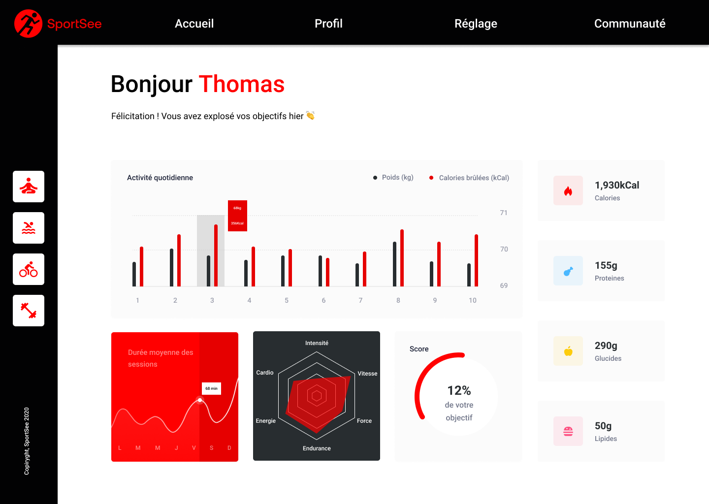

## SPORTSEE
## React dashboard analytics with ExpressJs micro API
---
### https://sportsee.herokuapp.com/
---

    

---

#### Class-based React architecture
---
#### STACK
- HTML5/CSS3/Javascript
- React
- Recharts library
- Styled Components
----
### Prerequisites

- [NodeJS](https://nodejs.org/en/)
- [Yarn](https://yarnpkg.com/)

<small>[ If you are working with several versions of NodeJS, we recommend you install [nvm](https://github.com/nvm-sh/nvm). This tool will allow you to easily manage your NodeJS versions. ]</small>

----
### Launching the project
- Fork the repository
- Clone it on your computer.
- The `npm i` command will allow you to install the dependencies.
- The `npm run start` command will allow you to run the micro API.
----
